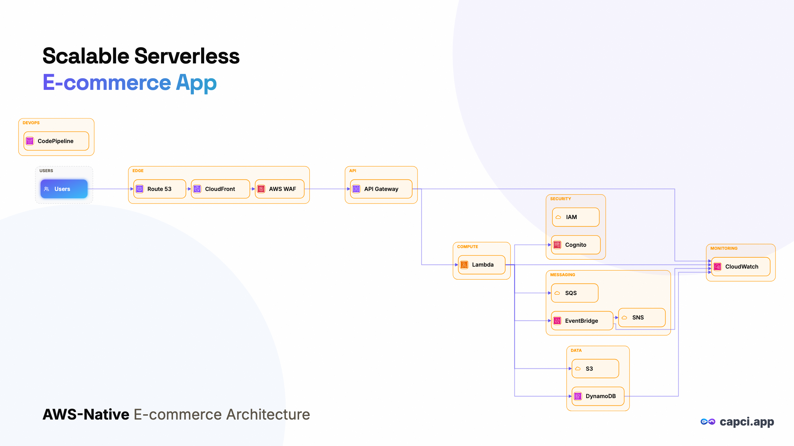
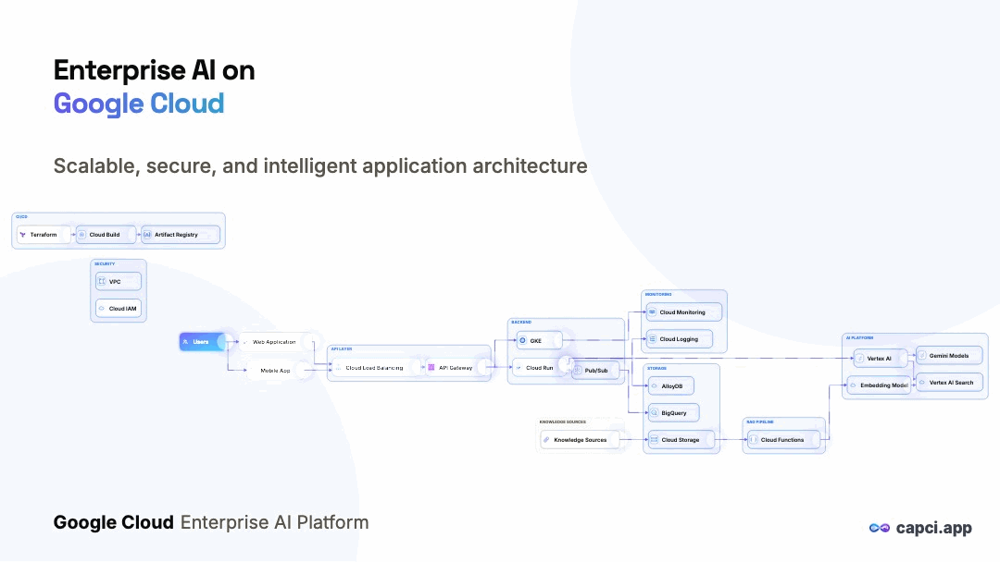

# Capci MCP — Text-to-Diagram MCP Server for Claude, VS Code & Antigravity

> Generate architecture diagrams, flowcharts, sequence/ER/class diagrams, and
> animated diagrams **from a plain-text prompt — without leaving your AI tool.**
> Capci runs as a remote [MCP](https://modelcontextprotocol.io) server, so any
> MCP-compatible host can create publish-ready visuals in one call.

**Works with:** Claude Desktop · Claude Code · VS Code · Google Antigravity ·
Gemini CLI · Cursor · any Streamable-HTTP MCP client.

**Keywords:** mcp diagram server · diagram in claude · diagram in vscode ·
diagram in antigravity · text to diagram · prompt to diagram · animated diagram



> One prompt in — *"architecture diagram of a serverless e-commerce platform"* —
> a publish-ready diagram out. You can even animate it:



---

## Why an MCP diagram server?

Your agent can already write code and prose. It *can't* draw a clean,
on-brand diagram — so you tab out to a diagramming app, fight with syntax, and
paste the result back. Capci closes that loop: the diagram is generated inside
the same conversation, from the same prompt, and comes back as an image you can
drop straight into a doc, PR, or slide.

- **One prompt in, a finished diagram out.** No DSL to learn, no canvas to nudge.
- **Real diagram types** — architecture (with real cloud-provider icons),
  flowchart, sequence, class, ER, mindmap, Gantt, data charts.
- **Animated diagrams & posts** — export a moving GIF, not just a static PNG.
- **Refine in place** — "make it dark theme," "add a cache layer," "widen it."
- **Brand-aware** — set your colors/logo once; every diagram inherits them.

## Quick start

1. Get an API key at **[capci.app](https://capci.app)** (free tier available).
2. Add the server to your tool using the config below.
3. Ask your agent: *"Create an architecture diagram of a Cloud Run API behind a
   load balancer with a Firestore backend."*

The endpoint is the same everywhere:

```
https://mcp.capci.app/mcp        (Streamable HTTP, header auth: x-api-key)
```

---

## Setup per host

### Claude Code

```bash
claude mcp add --transport http capci https://mcp.capci.app/mcp \
  --header "x-api-key: YOUR_API_KEY"
```

Then in any session: *"Use capci to draw a sequence diagram of the OAuth flow."*

### Claude Desktop

`Settings → Developer → Edit Config`, then add:

```json
{
  "mcpServers": {
    "capci": {
      "command": "npx",
      "args": [
        "-y", "mcp-remote", "https://mcp.capci.app/mcp",
        "--header", "x-api-key:YOUR_API_KEY"
      ]
    }
  }
}
```

Restart Claude Desktop. The Capci tools appear under the 🔌 menu.

### VS Code

Create `.vscode/mcp.json` in your workspace (or add to user settings):

```json
{
  "servers": {
    "capci": {
      "type": "http",
      "url": "https://mcp.capci.app/mcp",
      "headers": { "x-api-key": "${input:capci-key}" }
    }
  },
  "inputs": [
    { "id": "capci-key", "type": "promptString", "description": "Capci API key", "password": true }
  ]
}
```

Open Copilot Chat in Agent mode → the `capci` tools are available.

### Google Antigravity

Edit `~/.gemini/config/mcp_config.json` (or use the IDE's MCP settings panel)
and add a remote HTTP server. Antigravity uses `serverUrl` (not `url`) for
remote Streamable-HTTP servers:

```json
{
  "mcpServers": {
    "capci": {
      "serverUrl": "https://mcp.capci.app/mcp",
      "headers": { "x-api-key": "YOUR_API_KEY" }
    }
  }
}
```

Reload the MCP servers, and the agent can diagram directly inside your
Antigravity workflow.

### Gemini CLI

Edit `~/.gemini/settings.json` (global) or `.gemini/settings.json` in a project.
Gemini CLI uses `httpUrl` for a remote Streamable-HTTP server (not `url`, which
it treats as SSE, and not Antigravity's `serverUrl`):

```json
{
  "mcpServers": {
    "capci": {
      "httpUrl": "https://mcp.capci.app/mcp",
      "headers": { "x-api-key": "YOUR_API_KEY" }
    }
  }
}
```

Run `/mcp` inside Gemini CLI to confirm `capci` is connected.

### Cursor / other MCP hosts

Any host that supports remote **Streamable HTTP** MCP servers with custom
headers works — point it at `https://mcp.capci.app/mcp` and pass
`x-api-key: YOUR_API_KEY`.

---

## Tools

| Tool | What it does |
|---|---|
| `create_diagram` | Prompt → architecture / flowchart / sequence / class / ER / mindmap / Gantt. Returns a durable id. |
| `refine_diagram` | Edit or restyle an existing diagram by id ("add a queue," "dark theme"). |
| `animate_diagram` | Turn a diagram into an animated GIF (flow / build-in). |
| `create_post` | Branded social/marketing image from a prompt. |
| `create_chart` | Data → chart (bar / line / donut / KPI). |
| `create_logo` | Generate a logo. |
| `set_brand` | Set account colors/logo so every output is on-brand. |

## Example prompts

```
Create an architecture diagram: users → CDN → Cloud Run API → Firestore, with a
Pub/Sub side-channel to a worker.

Draw a sequence diagram of a webhook: Razorpay → our API → verify signature →
update Firestore → email the user.

Make an ER diagram for a blog: users, posts, comments, tags.

Animate the request flow in that architecture diagram as a GIF.
```

## FAQ

**Do I need to install anything?** No — it's a hosted remote server. Claude
Desktop uses the `mcp-remote` bridge shim; everything else connects natively.

**What does it cost?** There's a free tier to try it. See
[capci.app](https://capci.app) for current plans.

**Which diagram types are supported?** Architecture, flowchart, sequence,
class, ER, mindmap, Gantt, plus data charts and animated GIFs.

---

Built by [Capci](https://capci.app) — turn a prompt into publish-ready visuals.
